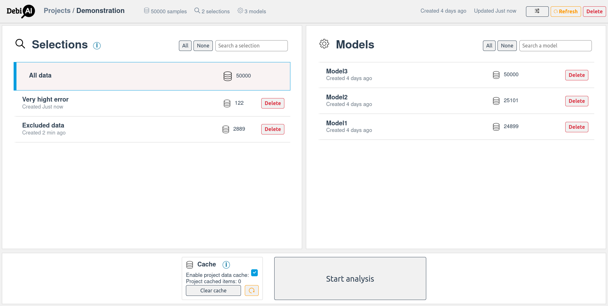
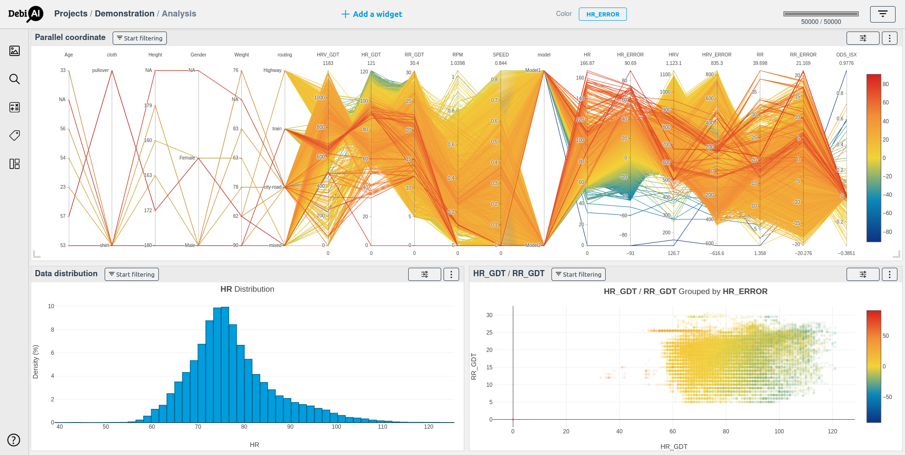
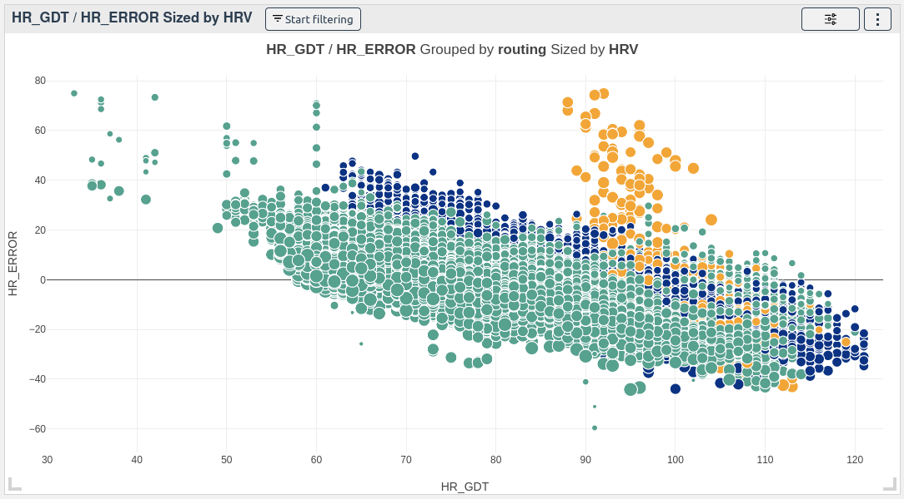

# Dashboard

DebiAI has a Graphical User Interface that allows you to navigate through your projects, select selections, select models and start an analysis.

## Project list

Before starting an analysis, you need to select a project from the project list.

    
    <em>Home page, project list</em>

If you have not yet created any projects, selections or models, refer to the [Python module](../dataInsertion/pythonModule/quickStart.md) or to the [Data providers](../dataInsertion/dataProviders/quickStart.md) guides.

## Starting an analysis

After selecting a project you can click on "Analyze" to load the project data and reach the analysis dashboard. If you have any selections or any model results in your project, you can select one or more before starting an analysis, this will only load the data that is in the selection or the model results.

    <em>Project page</em>

## Analysis page

After starting an analysis and after the data is loaded, you will be redirected to the analysis page. The analysis dashboard is the central part of DebiAI where you will be able to place widgets and explore your data and model results:

    <em>Analysis page of DebiAI</em>

### What is a widget?

A widget is an interactive component that you can manipulate to display different aspects of your data and model results.

    <em>A DebiAI Widget - 2D scatter plot</em>

A widget offers a set of controls, they are available in the top right corner of the widget:

    

First, the controls in the widget itself allow you to, from left to right:

<ul id="widget_controls">
  <li>
A widget
This is the name of the widget, you can change it by double clicking on it.</li>
  <li>
∇ Start filtering
To start filtering the data graphically with the widget.</li>
  <li>
☰
To open the settings panel of the widget.</li> 
</ul>

Then, in the menu, the controls allow you to, from top to bottom:

<ul id="widget_controls">
  <li>
📋 Duplicate
To create a copy of the widget with the same size and configuration.</li>
  <li>
🖼️ Download image
To export the widget plot as an image.</li>
  <li>
💬 Comment
To comment the widget. Comments will be added to the <a href="./analysisExport/">analysis report</a>.</li>
  <li>
💾 Save / Load settings
To save or load the <a href="./widgetConfigSave/">widget configuration</a>.</li>
  <li>
<b style="font-family: monospace; padding-right:4px">I</b> Rename
To open the settings panel of the widget.</li>
  <li>
<b style="font-family: monospace; padding-right:4px">X</b>Close
To remove the widget from the dashboard.</li>
</ul>

In addition to those controls, you can also interact with the widget itself by dragging it around the dashboard and resizing it

:::warning
Note that the controls available in the widget may vary depending on the widget type.
:::

DebiAI provides many widgets that allow you to explore your data and model results. To learn more about the available widgets, refer to the [Full widgets list](./widgets/README.md).

### Dashboard features:

Besides the widgets, the dashboard has several features that allow you to interact with the data and the dashboard itself:

- [Saving a layout](./layouts/). You can save your current dashboard layout to be able to load it later.

- [Custom algorithms](./algoProviders/). You can create your own algorithms, use them with the data in the dashboard to generate new analyzable columns.

- [Exporting data](./dataExport/). You can export your data to other tools for annotation or further analysis purposes.

- [Exporting analysis results](./analysisExport/). Once you have finished your analysis, you can generate a report with the results.
