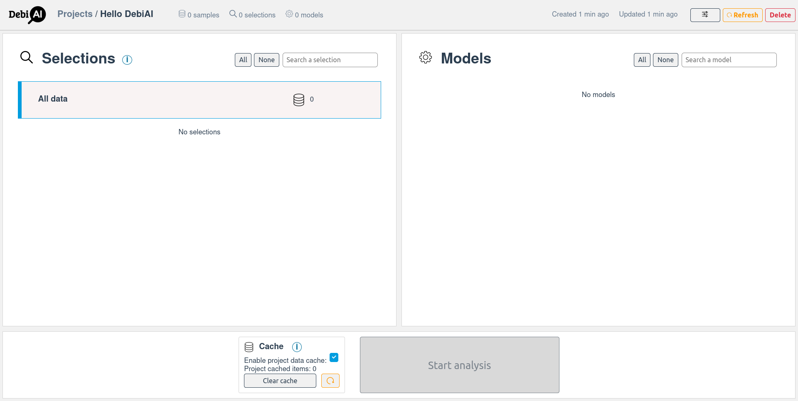
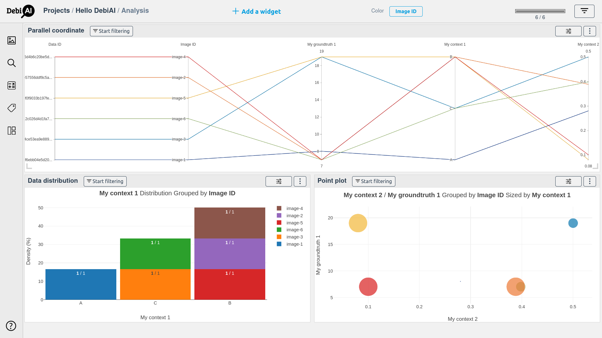
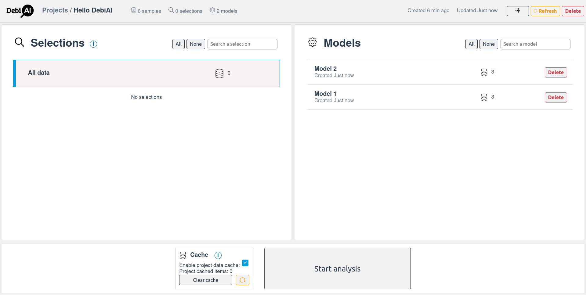
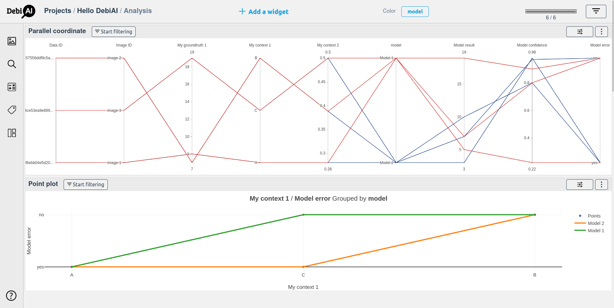

# Quick start

## Requirements

- A running DebiAI instance (see [DebiAI installation](../../introduction/gettingStarted/installation/README.md))
- [Numpy](https://www.numpy.org/install)
- [Pandas](https://pandas.pydata.org/pandas-docs/stable/install.html)
- Eventually [Tensorflow](https://www.tensorflow.org/install)

## Installation

```bash
pip install --upgrade debiai
```

You can now use the DebiAI module inside your script with `from debiai import debiai`

You can also check our [Manual installation guide](./installation/manual.html)

## Basic example

### Initialization and project creation

```python
from debiai import debiai
import pandas as pd
import numpy as np

DEBIAI_BACKEND_URL = "http://localhost:3000/"
DEBIAI_PROJECT_NAME = "Hello DebiAI"

# Initialisation
my_debiai = debiai.Debiai(DEBIAI_BACKEND_URL)

# Creating a project
debiai_project = my_debiai.create_project(DEBIAI_PROJECT_NAME)
```

A project named "Hello DebiAI" is now created.



If your DebiAI instance is not running locally, you can configure a specific adress by changing DEBIAI_BACKEND_URL. To create a project with an other name, change DEBIAI_PROJECT_NAME.

If the project already exists, you can get the project with: `debiai_project = my_debiai.get_project(DEBIAI_PROJECT_NAME)`

And if you want to delete the project: `my_debiai.delete_project_byId(DEBIAI_PROJECT_NAME)`

### Setting the data structure

Each data that you want to insert must be associated with:

- An **ID**: considering that the dataset and the results are inserted in two different steps, an ID is recquired for each inserted data in order to match them later.
- A **type**: `text`, `number` or `boolean`.
- A **label**: `inputs`, `groundTruth`, `contexts`, or `others`.

The type and the label are used for authorizing (or suggesting) specific data manipulation or visualizations.

To do so, a **block structure** must be defined, with at least one object containing the following keys:

- `name`: for setting the ID column
- `inputs`, `groundTruth`, `contexts`, or `others`: optional lists with the `type` and the `name` of the columns of your dataset.

```python
# Creating the project block structure
block_structure = [
    {
        # The sample: an image with contexts, GDT and an ID
        "name": "Image ID",
        "contexts": [
            {"name": "My context 1",     "type": "text"},
            {"name": "My context 2",     "type": "number"}
        ],
        "groundTruth": [
            {"name": "My groundtruth 1", "type": "number"}
        ]
    }
]

debiai_project.set_blockstructure(block_structure)
# A project data structure can be set only once per projects.
```

Note that the block structure is a list of such objects, for dealing with hierarchical information. More information will be given later.

The structure of the data is now set, the next step is to add them.

### Adding data

```python
# ======== Adding the project samples ========
# Adding samples with a dataframe
samples_df = pd.DataFrame({
    "Image ID":         ["image-1", "image-2", "image-3"],
    "My context 1":     ["A", "B", "C"],
    "My context 2":     [0.28, 0.388, 0.5],
    "My groundtruth 1": [8, 7, 19],
})

debiai_project.add_samples_pd(samples_df)
```

The added data need to follow the previously defined block structure, if the **_My groundtruth 1_** field is missing from the dataframe, DebiAI will throw an error. DebiAI will ignore the dataframe additional fields that haven't been defined in the block structure.

Let's add more samples from a np array:

```python
# ======== Adding the project samples ========
# Adding samples with a np array
samples_np = np.array([
    ["Image ID", "My context 1", "My context 2", "My groundtruth 1"],
    ["image-4", "B", 0.1, 7],
    ["image-5", "B", 0.08, 19],
    ["image-6", "C", 0.398, 7]
])

debiai_project.add_samples(samples_np)
```

The samples are now ready to be analysed with the dashboard.



An important feature of DebiAI is to analyse the results of some models in a contextual way: for instance, the results when "My context 1" is "A", "B" or "C" so let's add model results.

### Setting the results structure

The first step is to set, for your results, the equivalent of the _block structure_: each result must have an ID (to map them with the data), and a type.

To do so, an **expected results** must be defined (the equivalent of _block structure_, but for the results), with a list of object containing the _"name"_ of the column, and the _"type"_ ("text", "number" or "boolean"). There is no need to set the ID column: the ID column is set by default, with the same name it has in the block structure ("Image ID" in our case).

```python
# Setting the project models expected results
expected_results = [
    {"name": "Model result",     "type": "number"},
    {"name": "Model confidence", "type": "number"},
    {"name": "Model error",      "type": "text"},
]

debiai_project.set_expected_results(expected_results)
```

Note that in the "results", we can directly add error metrics.

A project results structure can be set only once.

### Adding results

Results must be associated to a specific model, so the first step is to create one:

```python
# Create a first model
debiai_model_1 = debiai_project.create_model("Model 1")
```

Now that both the structure of the results is set, and a model is created, you can add some results to a specific model.

Here we are adding results for the first model with a dataframe:

```python
# Adding results with a dataframe
results_df = pd.DataFrame({
    "Image ID": ["image-1", "image-2", "image-3"],
    "Model result": [5, 7, 19],
    "Model confidence": [0.22, 0.8, 0.9],
    "Model error": ["yes", "no", "no"],
})

debiai_model_1.add_results_df(results_df)
```

If later on you have a second model, you can create an other model.

```python
# Create a second model
debiai_model_2 = debiai_project.create_model("Model 2")
```

This time we will use a numpy array, instead of a dataframe, for inserting results:

```python
# Adding results with a numpy Array
results_np = np.array(
    [["Image ID", "Model result", "Model confidence", "Model error"],
     ["image-1", 3,  0.98, "yes"],
     ["image-2", 7,  0.97, "no"],
     ["image-3", 10, 0.8, "yes"]]
)

debiai_model_2.add_results_np(results_np)
```

Now, both the data and the 2 models are ready to be analysed with the Debiai dashboard.




## Limitations

- Nan or empty values are not supported at the moment.
- `/`, `.`, `:`, `?`, `*`, `\`, and `|`, are not supported in the project name and in the data/blocks ids.

> :warning: **If the data don't upload or don't load**: check that there is only string, number or boolean values (no Nan, objects or array values) in the data that you are uploading, and that there is no special character in the project name and the data ids.

Note that the DebiAI Python module is in Alpha version, and is not yet stable, feel free to report any issue or suggestion.

#### The next step is to [analyse your data with the DebiAI dashboard](../../dashboard/README.md).

## Disabling the DebiAI module Data Provider

If you are using a [WEB Pata Provider](../dataProviders/) and you want to make make DebiAI read only, you may want to disable the DebiAI python module Data Provider.

If you want to disable the DebiAI module, you can do it by adding the environment variable `DEBIAI_PYTHON_MODULE_DATA_PROVIDER_ENABLED` to `False` when starting DebiAI, or edit the `config.ini` file:

```ini
[PYTHON_MODULE_DATA_PROVIDER]
enabled = False
```
