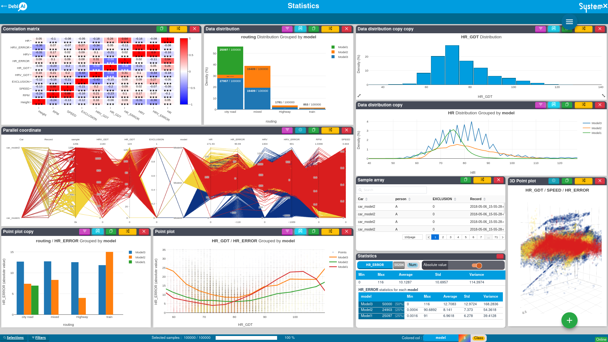

# Introduction

DebiAI is an open-source web application that aims to facilitate the process of developing Machine Learning models, especially in the stage of the project data analysis and the model performance comparison.

DebiAI provides data scientists with features to:

- Identify biases and errors in your input, results, contextual or ground truth project data
- Make a comparison of the performance of your ML models according to their contextual results
- Select and create sets of data graphically for further analysis or (re-)training purposes
- Quickly create and share statistical visualizations of your project data for your team or client

## Dashboard

DebiAI has a Graphical User Interface with a complete data visualization toolkit offering many statistical analysis tools:

The dashboard is customizable and can be used for both large and small projects. Learn more about the [widgets and how to use them](../dashboard/widgets/).

## Data

DebiAI is designed to be used for any kind projects and data, it is particularly useful for projects that involve many contextual data.

DebiAI provide two main ways to import your data, to learn more about them, check out the [data insertion](../dataInsertion/README.md) section. 

## Installation

DebiAI is available as a Docker image. To install it, you can follow the [installation guide](gettingStarted/installation/README.md).

## Use cases

As part of the [Confiance.ai](https://www.confiance.ai/) program, we (the [IRT SystemX](https://www.irt-systemx.fr/)) are using and developing DebiAI for a wide range of use cases.

One of them is the [Valeo - WoodScape](../useCases/woodscape/) dataset.

## Who is DebiAI for?

DebiAI is a high level data exploration tool for data scientists and machine learning experts. It is designed to be easily integrated in your project workflow.

[Get started](gettingStarted/README.md)

