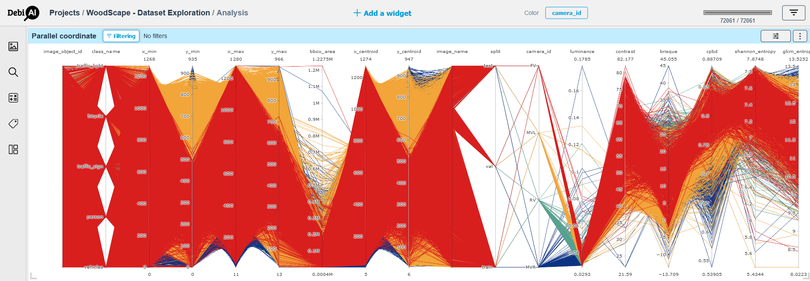
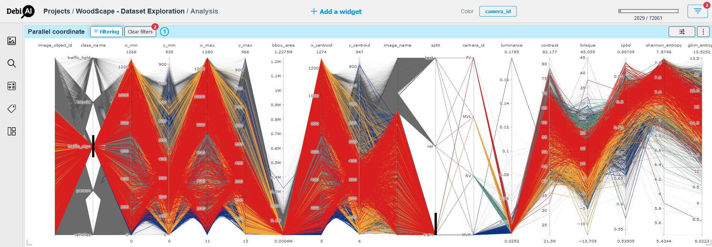
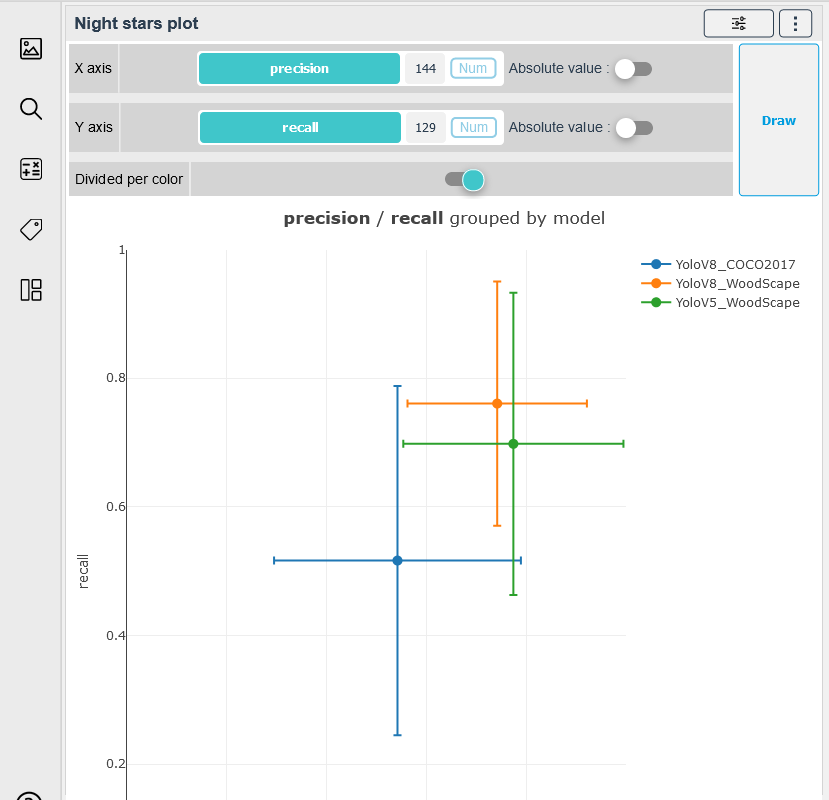
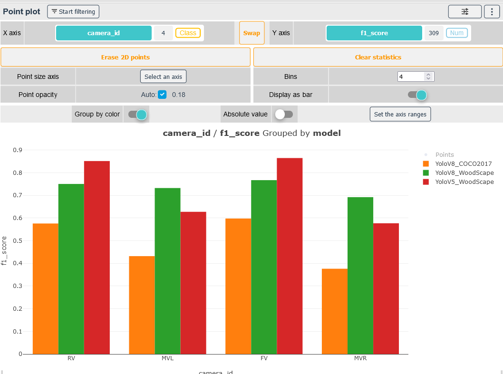
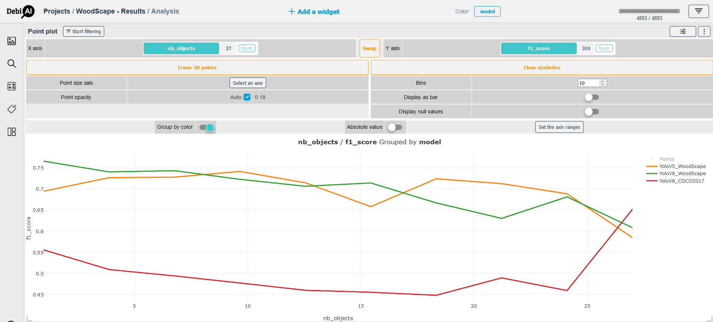

# DebiAI tutorial via the WoodScape use case

  
 

The aim of this tutorial is to showcase the capabilities of DebiAI and its plus value in a Machine Learning project via an industrial use case which is a 2D objects detection task using the WoodScape dataset.

The [WoodScape dataset](https://woodscape.valeo.com/woodscape/) is a public dataset containing more than *100K images* of urban scenes captured using fish-eye cameras for automotive driving tasks. The images are provided by 4 different cameras with different angles of view (front, rear, middle right and middle left) with 360° coverage and have annotations for a diverse set of computer vision tasks.
 
In this case study, we used *8.234 images* (divided into three sets: train, validation and test) and we focused on the 2D bounding boxes detection task with five classes: *vehicle, person, bicycle, traffic light and traffic sign.*

 

This tutorial will be divided into two distinct sections, each one ties to a specific project in the DebiAI Demo Instance:

1. Exploring the dataset before the training process in the project *WoodScape - Objects*. [See here](#dataset-exploration)
2. Analysing the models results in the project *WoodScape - Images*. [See here](#results-analysis)

 
 

## Dataset Exploration: WoodScape Objects Project

In this part of the tutorial, we will focus on the exploration of the WoodScape dataset's objects distribution and all the observations we can draw from it to help us design and execute our learning process accurately.

### Parallel Coordinate [Documentation](https://debiai.irt-systemx.fr/dashboard/widgets/1_parallel_coordinates/) 
In the parallel coordinate widget we select the columns of the dataset we want to explore.
First, We use the parallel coordinate to get an overview of our dataset and introduce DebiAI's most useful features:  
1. Get a summary of the dataset columns overall distribution, this will help us get a grasp of the dataset distribution and spot outliers.
2. Select some columns to explore their data by selecting values and trying to spot outliers and biases. 

The [Figure 1](#figure-01---the-parallel-coordinates-of-the-woodscape-dataset-before-filtering) displays the parallel coordinates of all the columns of the WoodScape dataset. We can observe that our graph is coloured / filtered by the values of the column "camera_id"; we can achieve that by using the **“color button”** and position the selection on the column "camera_id" then redraw the graph using the **"redraw button"** that appears on the top of the widget. 

The [Figure 2](#figure-02---the-parallel-coordinates-of-the-woodscape-dataset-after-filtering-to-get-the-train-set-and-the-traffic-sign-class-data) shows some filters applied on the same parallel coordinate to select data. 
 
To select data on a parallel coordinates, DebiAI offer two distinct ways:
1. Using the **"filters button"** on the top right of the page by adding the columns and the values of our selection. 
2. Draw a vertical line on the values on parallel coordinate as demonstrated in the [Figure 2](#figure-02---the-parallel-coordinates-of-the-woodscape-dataset-after-filtering-to-get-the-train-set-and-the-traffic-sign-class-data).

We can clear the filters by cliquing on the **"clear filters button"** that appears on the top of the widget.

##### Figure 01 - The Parallel coordinates of the WoodScape dataset before filtering. 

##### Figure 02 - The Parallel coordinates of the WoodScape dataset after filtering to get the train set and the traffic sign class data.

From the two figures above we can easily spot that our dataset is relatively balanced in terms of the camera distribution and that we may have some outliers in term of the bounding box areas.

To further investigates the dataset, we explore the distribution of each one of the train, validation and test sets using the **“Data Distribution”** widget.

### Data Distribution  [Documentation](https://debiai.irt-systemx.fr/dashboard/widgets/1_parallel_coordinates/) 
The [Figure 3](#figure-03---woodscape-dataset-split-from-left-to-train-train-validation-and-test-by-objects-class-distribution-grouped-by-camera-id) displays the distribution of each of the three sets by the class name grouped by the camera id. 

To create the below figure, we used the **"Data Distribution"** widget, selected the class name for the x-axis while having the "color" filter on the "camera_id". 
 
To obtain the distribution of the train set, we used the **"filter button"**: we selected the column "split" then redrew the graphic using the prompted **"redraw button"** on the top of the widget.
 
DebiAI allows us to duplicate widgets along with their parameters. We made use of this feature to have two additional widgets in order to display the validation and test sets distributions following the same steps to filter their data.
 
We can check the filters applied for each widget by clicking on the **"filters applied button"**.

##### Figure 03 - WoodScape dataset split (from left to train: train, validation and test) by objects class distribution grouped by Camera ID

A first observation from the [Figure 3](#figure-03---woodscape-dataset-split-from-left-to-train-train-validation-and-test-by-objects-class-distribution-grouped-by-camera-id) is the spectacular imbalance in the distribution of the five objects classes which is inherently related to the nature and the context of the task; in an urban road scene and in day time, it is normal to have more vehicles compared to traffic lights and traffic signs on the road. But it is important to perceive that we keep the same tendency / bias all over the three sets which is important for the accurate interpretation of the model’s outputs. <!-- The proportion of objects is more like homogenous across the four cameras in the three sets. -->

 

## Results Analysis: WoodScape Images Project
We used two versions of [YOLO](https://arxiv.org/abs/1506.02640)-based architectures, specifically YOLOv5 and YOLOv8. A YOLOv5 and a YOLOv8 models trained on WoodScape's train set and a YOLOv8 model trained on the [COCO2017](https://arxiv.org/abs/1405.0312) dataset.

We assess the performances of our models on the WoodScape's test set for each of the three models by using the column "model" as color filter for the rest of the analysis.

### Night Stars Plot  [Documentation](https://debiai.irt-systemx.fr/dashboard/widgets/night_stars_plot/) 
We use the **Night Stars Plot** widget to display the relationship between the precision and the recall of each model to help us navigate the trade-off between the quality and the quantity of detections: are we favouring / prioritizing the safety or the availability of our detection system.

The [Figure 4](#figure-05-the-relationship-between-the-precision-and-recall-for-each-model-using-the-night-stars-plot-widget) shows that the two models trained on the WoodScape's train set have better performances with one having better precision and the other showcasing better recall.

##### Figure 04: The relationship between the Precision and Recall for each Model using the Night Stars Plot widget

To further investigate the performances of our models giving the context of the task, we use other widgets to help us go deeper into the analysis.

#### Point Plot  [Documentation](https://debiai.irt-systemx.fr/dashboard/widgets/3_point_plot/)
The [Figure 5](#figure-05-the-f1-score-of-each-model-by-the-camera-id-grouped-by-model) displays the f1-score of each model by the "camera id"; we observe that the Yolov5 have better score on the data from the front and rear cameras (FV & RV) comparing to the two other models while the Yolov8 have the best performances when used on data coming from middle view cameras (MVR & MVL); this can be an indicator to use two distinct models depending on the position of the cameras. 

##### Figure 05: The f1-score of each model by the camera id grouped by model

Another analysis that may help us selecting the best model is to study the effect of the number of objects in each image on the f1-score, which is shown in the [Figure 6](#figure-06-the-effect-of-the-number-of-objects-in-a-frame-on-the-f1-score). The overall tendency that can be observed in this plot is that the two models trained on the WoodScape's train set tend to less perform when provided with frames containing more than 20 objects.

##### Figure 06: The effect of the number of objects in a frame on the f1-score

#### To go further:
Another question that arises is if the category of the objects influences the performance of the model. In order to explore this hypothesis, we choose two categories of objects *vehicles* and *persons* to study this possible correlation.  
The [Figure 7](#figure-07---correlation-between-the-objects-categories-and-the-f1-score-left-f1-score-by-the-number-of-vehicles-right-f1-score-by-the-number-of-persons) displays the plots of the f1-score by the number of vehicles per image (left) and the number of persons per frame (right); a first observation is that the models' performances degrade as the number of persons increases, in the other hand, the performances improve as the number of vehicles grows in the images, which indicates that our models have a certain bias towards the vehicle category. This can be explained by the fact that our dataset has more objects belonging to this category compared to the four others.

##### Figure 07 - Correlation between the objects' categories and the f1-score; left: f1-score by the number of vehicles, right: f1-score by the number of persons

Giving the last observation, we can conclude that it is important to conduct more training experiments to try to eliminate the bias induced by the task's context using different training techniques for imbalanced datasets.